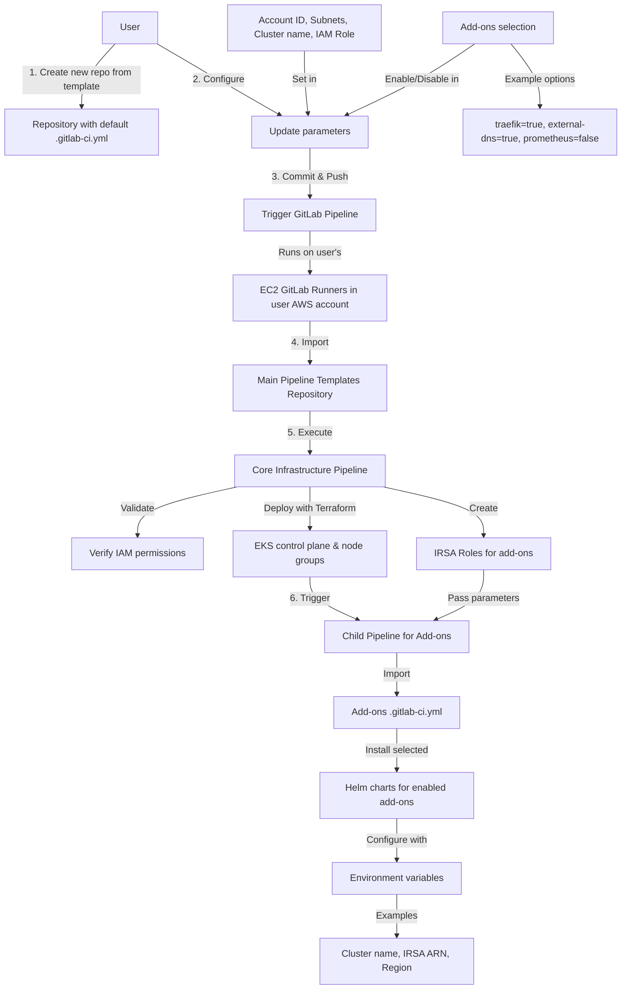
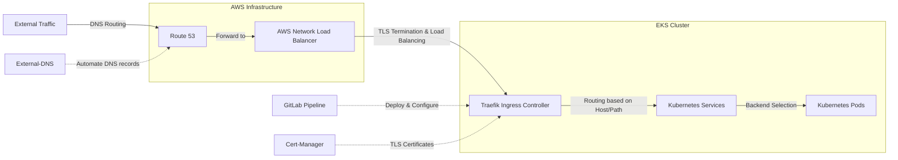
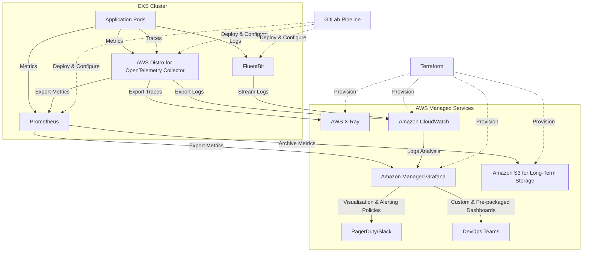
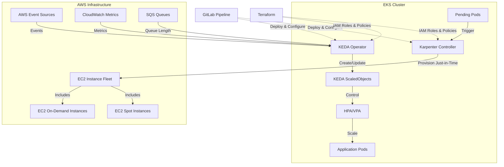
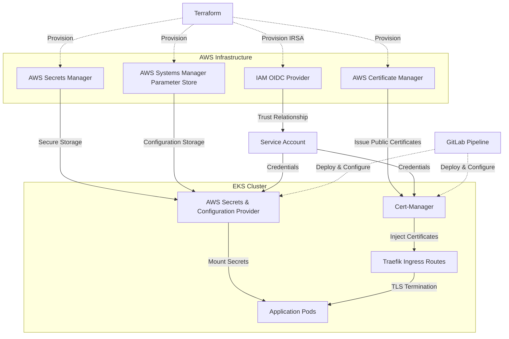

# EKS Deployment Architecture with GitLab CI/CD

## Introduction

This document outlines a GitLab CI/CD-based deployment architecture for Amazon EKS clusters using Infrastructure as Code (IaC) with Terraform and Kubernetes resources via Helm charts. The solution enables teams to quickly provision production-ready EKS clusters with standardized add-ons while maintaining flexibility for customization.

The architecture follows a modular approach where users can specify their infrastructure requirements in a simple configuration file, while the heavy lifting is performed by centralized, reusable pipeline templates. This reduces duplication of code, ensures consistent deployments across teams, and implements organizational best practices by default.

Key components include:
- User-configurable EKS infrastructure deployment via Terraform
- Automated installation of essential add-ons via Helm charts
- Standardized ingress with Traefik
- Comprehensive observability with Prometheus, Grafana, X-ray, and CloudWatch
- Advanced scaling with Karpenter and KEDA
- Enhanced security with cert-manager, ACM, and AWS Secrets Provider

## User Deployment Workflow

The deployment process is designed to be straightforward for end users while maintaining robust security controls and standardization. Users only need to focus on their specific requirements while the underlying complexities are abstracted away.

## Ingress Architecture

The ingress architecture leverages AWS Route 53 for DNS routing, Network Load Balancer for efficient traffic management, and Traefik as the ingress controller within the Kubernetes cluster.

## Observability Architecture

The observability stack provides comprehensive monitoring, logging, metrics collection, and tracing capabilities across the EKS cluster.

## Scaling Architecture

The scaling architecture uses Karpenter for efficient node provisioning and KEDA for event-driven autoscaling of pods.

## Security Architecture

The security architecture implements robust certificate management and secure secret handling.

## Deployment & Operations

The entire infrastructure and application deployment is orchestrated through GitLab CI/CD pipelines:

1. **Infrastructure Pipeline**: Provisions and configures the EKS cluster and supporting AWS resources using Terraform
2. **Add-ons Pipeline**: Installs and configures Kubernetes add-ons using Helm charts
3. **Application Pipeline**: Deploys and configures user applications on the EKS cluster

Operational tasks are also automated:
- Cluster upgrades are handled via GitLab CI/CD with blue/green deployment strategy
- Certificate rotation is automated via cert-manager
- Secret rotation is automated via AWS Secrets Manager
- Configuration changes are applied via GitOps workflow

The modular design allows teams to customize their infrastructure while maintaining organizational standards and security best practices.
